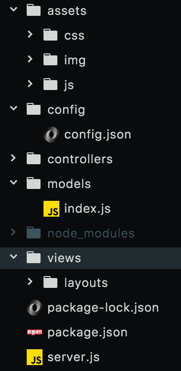
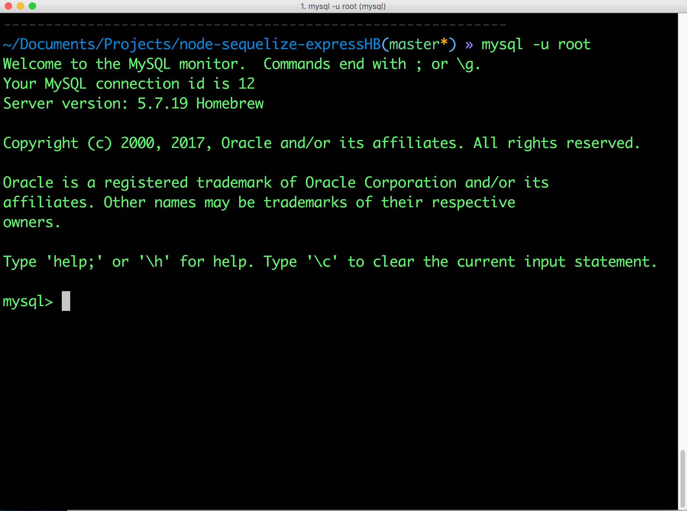
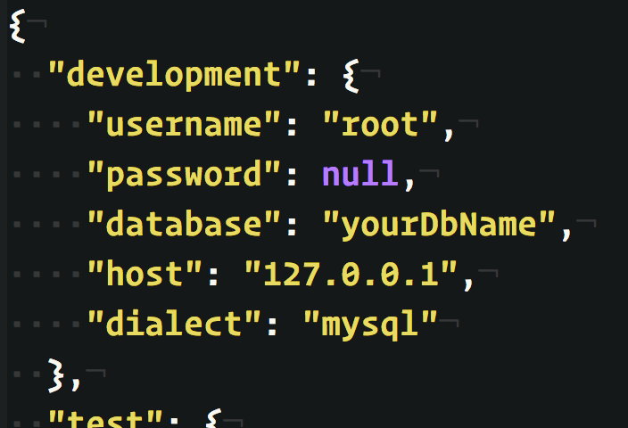

# Working With...
* [**Node.JS**](https://nodejs.org/en/)
* [**Sequelize**](http://docs.sequelizejs.com/)
* [**Express**](https://www.npmjs.com/package/express)
* [**Express-Handlebars**](https://www.npmjs.com/package/express-handlebars)

Mistake corrections welcome! [eric@ericcreates.com](mailto:eric@ericcreates.com?Subject=mistake)

Or create an issue by clicking [here](https://github.com/EpicWiz/howto-node-sequelize-express-expressHB/issues).

### A jump start to getting your node.js app working from top to bottom.

This guide assumes you have some basic grasp of the building blocks of a website. At this point you should have prepared your favorite text or code editor. I personally use [Atom](https://atom.io/), but anything similar works fine. In order to really get the most out of it, you would be better off already having a foundation in [**HTML**](https://developer.mozilla.org/en-US/docs/Web/HTML), [**CSS**](https://developer.mozilla.org/en-US/docs/Web/CSS), [**JavaScript**](https://developer.mozilla.org/en-US/docs/Web/JavaScript), and an understanding of [**relational databases**](https://en.wikipedia.org/wiki/Relational_database).

## Contents

### 1. [Installations](#installations)
### 2. [Project Directory](#directory)
### 3. [Sequelize-CLI Files](#sequelize-cli-files)
### 4. [MVC](#mvc)
### 5. [Files with Notes](#files-with-notes)
### 6. [Getting Example Set Up](#getting-example-set-up)
### 7. [Final Notes](#final-notes)

## Installations
The following is the easiest way that I've found to get everything working on a mac. If you aren't using a mac, or if the steps listed are somehow not working for you, please visit the reference links for more information.

### Linux Installation Instructions

These steps were generously provided by (Namho Kim)[https://github.com/namho-kim], a knowledgable and nearly exclusive user of linux.

####Pull request for installing on Linux (since most servers are Linux).

**Nodejs**

*Ubuntu:*

`sudo apt-get install nodejs`

*CentOS/RHEL:*

`sudo yum install nodejs`

*Fedora:*

`sudo dnf install nodejs`

**MySQL**

*Ubuntu:*

`sudo apt-get install mysql-server`

*CentOS/RHEL:*

`sudo yum install mariadb-server mariadb`

*Fedora:*

`sudo dnf install mariadb-server mariadb`

_If you must use MySQL for some reason:_

Download the RPM for your OS here: <https://dev.mysql.com/downloads/repo/yum/>

If this is on a web server, you'll want to use wget. Right click on the DOWNLOAD button and click `copy link location`. Then download it by running:

`wget <download url>`

Then install:

`sudo yum localinstall <file-you-downloaded>.rpm`

Enable 5.7 or 5.6 depending on your preferences (go with 5.7):

`sudo yum-config-manager --disable mysql56-community
sudo yum-config-manager --enable mysql57-community`

Install:

`sudo yum install mysql-server-community
(replace yum with dnf in Fedora)
`

Start MySQL/Mariadb:

`sudo systemctl start mariadb
sudo systemctl start mysqld`

Optional, but you should do this especially if this is a server not a local machine:

`sudo mysql_secure_installation`

Follow the steps that come out.

### Get Homebrew (macOS only)
Homebrew is a package manager for macOS. This means you can use it to install a lot more useful things far more easily than through alternative means.

* First you'll have to open up your terminal.

* Press `CMD` + `Space` to pull up spotlight.

* Then go ahead and type the following into your terminal and press `Enter`:

`/usr/bin/ruby -e "$(curl -fsSL https://raw.githubusercontent.com/Homebrew/install/master/install)"`

This will get **Homebrew** installed on your machine. It should look something like the following...

Next type `brew --version` into the console.

It should return something that looks like...

`Homebrew 1.3.1`
`Homebrew/homebrew-core (git revision 22df; last commit 2017-09-01)`

**Homebrew Reference Links**

<https://brew.sh/>

<https://github.com/Homebrew/brew/>

### Install MySQL
In order to have persistent data we need a database. Go ahead and use [**Homebrew**](https://brew.sh/) to install MySQL.

Type the following into your terminal and press `Enter`:

`brew install mysql`

After MySQL installs you may need to manually start it up. You can accomplish this by entering the following command.

`mysql.server start`

If it won't start up after this point, or if you cannot connect to the database, please visit the MySQL reference link for more help. To test out your MySQL database connection, try using [MySQL Workbench](https://www.mysql.com/products/workbench/).

**MySQL Reference Link**

<https://www.mysql.com/>

### Install node.js
Node (and the many many packages available to extend its abilities) is how we'll be able to use JavaScript on the back end of your site. Again, use brew to download and install MySQL.

Type the following into your terminal and press `Enter`:

`brew install node`

**node.js Reference Link**

<https://nodejs.org/en/>

## Directory

**"Folder" = "Directory"**

Create a new directory wherever you like, then using your terminal navigate to inside that directory.

Follow these steps to import the npm packages and set up the structure of your application:

In the terminal:

I always do this first, because the next step initializes node with this file as the entry point. It is not required, and you can change the start script in the `package.json` file at any time later on.

1. `touch server.js` then `Enter`

This skips over a few steps where you can customize the details about your application, but additionally makes some assumptions and inputs data into some fields for you. An example being if you are initializing in a directory that is linked to a git repository. It will detect that and input the details for you.

2. `npm init -y` then `Enter`

This will install all the node packages essential to this example. You can do each package one by one, or list them all at once as I did above. (ie: `npm install express` then `npm install sequelize` etc.)

3. `npm install express sequelize sequelize-cli mysql2 body-parser method-override express-handlebars` then `Enter`

Please note, that for older versions of node, you may need to add a space and `--save` after the above listed command before pressing `Enter` in order to ensure it is listed in the `dependencies` properly.

At this point you should have the directory `node_modules` and the files `package-lock.json`, `package.json`, and `server.js` inside your directory. This step will create more of the file structure for you. Specifically, the `config` and `models` directories. Inside `config` you will find the `config.json` file, and inside `models` you will find the `index.js` file after this step. Additionally, if you installed `Sequelize` globally, you can use the shortened version of this command, which is `sequelize init:config init:models`. To see the other possible tasks you can initialize with this method visit the npm [sequelize-cli](https://www.npmjs.com/package/sequelize-cli) page.

4. `node_modules/.bin/sequelize init:config init:models` then `Enter`

## Sequelize-CLI Files

I've created notes explaining the details of the files generated at `/config/config.json` and `/models/index.js` so that everything going on within them is as clear and understandable as I am capable of making it.

1. Click [`/config/config.json`](./config-wNotes.json) to view the notes on this file.

2. Click [`/models/index.js`](./model-index-wNotes.js) to view the notes on this file.

##### Here is a sample from the `index.js` file

## MVC

MVC (model view controller) is a file structuring style that separates the three crucial elements of your web page or application. `Sequelize-CLI` already helped to get the models directory created, so we should go ahead and create the `views` and `controllers` directories. You will also need to create the `layouts` subdirectory inside `views`. In addition to those you will also make a directory called `assets` that will contain all of your publicly visible files. Inside the `assets` directory I usually make a `css`, `img`, and `js` subdirectory. While not required, it is helpful to keep your files organized.

Your file structure should look similar to what is shown below.

## Files With notes

In the included `example` directory you will find a simple template with 1-2 example files demonstrating how each of these packages work together. Some files I have created notated examples for and provided them with the names formatted similarly to `filename-wNotes.xxx`. In all other files I have left notes to explain the functionality. Download the example directory and follow the directions below to get started.

## Getting Example Set Up

If you've been following along from the beginning, you should have all of your node modules installed already. However, if you've jumped ahead and simply wish to grab the example directly and get started from here I can still help you out.

#### For those starting from here only

1. Download example, or clone this repository and copy the folder to wherever you like.
2. Open your terminal and navigate to the example directory. Once there type the following:

`npm install` then hit `Enter`

That should install all of the modules required for your template. If you want to see what it will be installing before you take this step, you can check the `package.json` file, and look at what is listed under `dependencies`.

3. Go back to the steps [Sequelize-CLI](#sequelize-clie) and [MVC](#mvc) to see what other directories you still need to create before continuing.

#### For everyone...

1. Create your application's database.

* In your terminal, type `mysql -u root` then hit `Enter`. You may be prompted for the MySQL password (if you set one). If so type it in and hit `Enter`. After that you will see a prompt that looks like the image below. If you have any problems getting through this, check out [this link](https://dev.mysql.com/doc/mysql-getting-started/en/) for more assistance.

* At the MySQL prompt, type the following commands to get started:

`CREATE DATABASE <yourDbName>;` then hit `Enter`

That's it!

Type `quit` and press `Enter`. You should now have a normal terminal prompt.

2. Adding the database info to your `config.json` file.

Now put the name of your database into `config.json` in the `"development"` object next to `"database"`. Additionally, you will need to put the MySQL username next to `"username"` which is most likely just `root`, your password next to `"password"` (or `null` if you haven't set one), and you should be good to go.

3. Adding an **Express-Handlebars** page.

The only file that should be in `./views/layouts` should be your `main.handlebars` file. All of your other `.handlebars` files should go directly into the `./views` directory.

`index.handlebars` is included in the `example/views` directory with some notes to help you along.

4. Add a **Sequelize** model.

Inside the `/example/models` directory there is already an example of a Sequelize model with notes to help you along.

5. Add your controllers.

`./example/controllers` contains `html-routes.js` and `api-routes.js` files with some helpful notes. Within these files I included examples of `GET`, `POST`, `PUT`, and `DELETE` sequelize database queries. Additionally, there is an example that uses promises.

## Final notes

This guide is a work in progress. I really wanted to have something helpful that I, and perhaps others, could reference in order to get a node-sequelize-express-handlebars app up and running as quickly as possible.

There are many steps involved in making an application for the web, and it's easy to mix things up and lose yourself if you're not careful.

You'll often hear mention of `reusable` code when you talk with many developers, and that's exactly what I aimed to provide here. It's just a piece of reusable code that I've elected to share with you.

`CRUD` (create, read, update, delete) is represented in the example files along with some notes.

* I hope this guide was helpful to you.
* Please let me know if you see any mistakes by creating an **[issue](https://github.com/EpicWiz/howto-node-sequelize-express-expressHB/issues)**. (code, spelling, grammar, etc.) Or if you can think of some additional tips that would be helpful. I'll credit the tip to you for your help.
* I encourage you to use this repository to do whatever you want.
* If you're going to copy this `README.md` file to post somewhere else, I would appreciate it if you would credit me or link to this repository.
