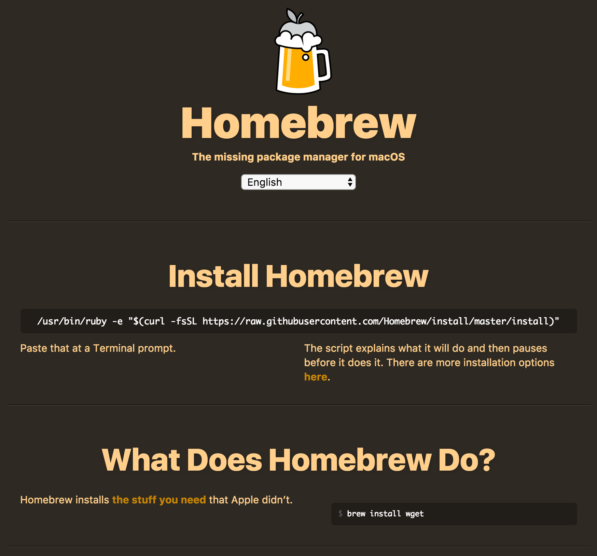
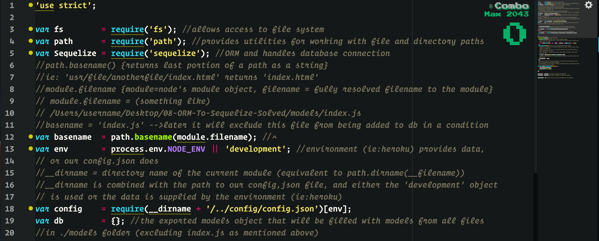

# Working With...
* [**Node.JS**](https://nodejs.org/en/)
* [**Sequelize**](http://docs.sequelizejs.com/)
* [**Express**](https://www.npmjs.com/package/express)
* [**Express-Handlebars**](https://www.npmjs.com/package/express-handlebars)

### A jump start to getting your node.js app working from top to bottom.

This guide assumes you have some basic grasp of the building blocks of a website. At this point you should have prepared your favorite text or code editor. I personally use [Atom](https://atom.io/), but anything similar works fine. In order to really get the most out of it, you would be better off already having a foundation in [**HTML**](https://developer.mozilla.org/en-US/docs/Web/HTML), [**CSS**](https://developer.mozilla.org/en-US/docs/Web/CSS), [**JavaScript**](https://developer.mozilla.org/en-US/docs/Web/JavaScript), and an understanding of [**relational databases**](https://en.wikipedia.org/wiki/Relational_database).

## Contents

### 1. [Installations](#installations)
### 2. [Directory](#directory)
### 3. [Sequelize-CLI Files](#sequelize-cli-files)

## Installations
The following is the easiest way that I've found to get everything working on a mac. If you aren't using a mac, or if the steps listed are somehow not working for you, please visit the reference links for more information.

### Get Homebrew (macOS only)
Homebrew is a package manager for macOS. This means you can use it to install a lot more useful things far more easily than through alternative means.

* First you'll have to open up your terminal.

* _Press `CMD` + `Space` to pull up spotlight._

* Then go ahead and type the following into your terminal and press `Enter`:

`/usr/bin/ruby -e "$(curl -fsSL https://raw.githubusercontent.com/Homebrew/install/master/install)"`

This will get **Homebrew** installed on your machine. It should look something like the following...

Next type `brew --version` into the console.

It should return something that looks like...

`Homebrew 1.3.1`
`Homebrew/homebrew-core (git revision 22df; last commit 2017-09-01)`

**Homebrew Reference Links**

<https://brew.sh/>

<https://github.com/Homebrew/brew/>

### Install MySQL
In order to have persistent data we need a database. Go ahead and use [**Homebrew**](https://brew.sh/) to install MySQL.

Type the following into your terminal and press `Enter`:

`brew install mysql`

**MySQL Reference Link**

<https://www.mysql.com/>

### Install node.js
Node (and the many many packages available to extend its abilities) is how we'll be able to use JavaScript on the back end of our site. Again, use brew to download and install MySQL.

Type the following into your terminal and press `Enter`:

`brew install node`

**node.js Reference Link**

<https://nodejs.org/en/>

## Directory

**"Folder" = "Directory"**

Create a new directory wherever you like, then using your terminal navigate to inside that directory.

Follow these steps to import the npm packages and set up the structure of your application:

In the terminal:

I always do this first, because the next step initializes node with this file as the entry point. It is not required, and you can change the start script in the `package.json` file at any time later on.

1. `touch server.js` then `Enter`

This skips over a few steps where you can customize the details about your application, but additionally makes some assumptions and inputs data into some fields for you. An example being if you are initializing in a directory that is linked to a git repository. It will detect that and input the details for you.

2. `npm init -y` then `Enter`

This will install all the node packages essential to this example. You can do each package one by one, or list them all at once as I did above. (ie: `npm install express` then `npm install sequelize` etc.)

3. `npm install express sequelize sequelize-cli mysql2 body-parser method-override express-handlebars` then `Enter`

At this point you should have the directory `node_modules` and the files `package-lock.json`, `package.json`, and `server.js` inside your directory. This step will create more of the file structure for you. Specifically, the `config` and `models` directories. Inside `config` you will find the `config.json` file, and inside `models` you will find the `index.js` files after this step. Additionally, if you installed `Sequelize` globally, you can use the shortened version of this command, which is `sequelize init:config init:models`. To see the other possible tasks you can initialize with this method visit the npm [sequelize-cli](https://www.npmjs.com/package/sequelize-cli) page.

4. `node_modules/.bin/sequelize init:config init:models`

## Sequelize-CLI Files

I've created notes explaining the details of the files generated at `/config/config.json` and `/models/index.js` so that everything going in within them is as clear and understandable as I could make it.

